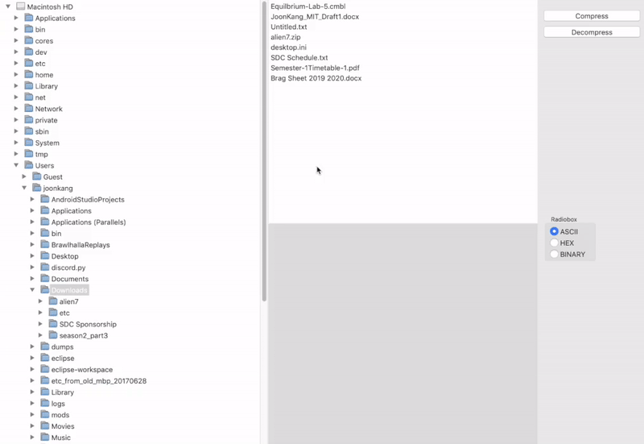
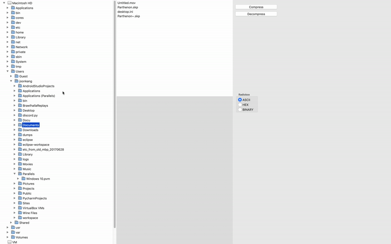
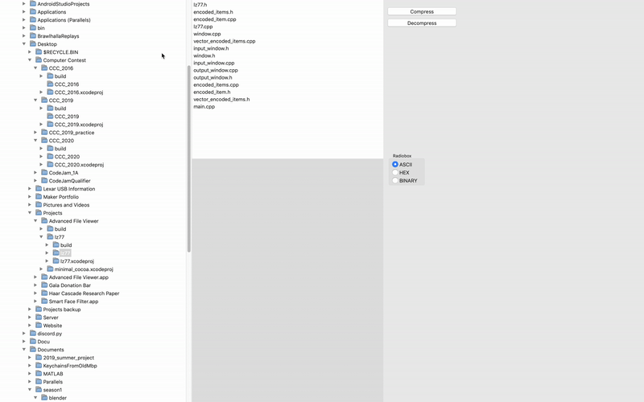
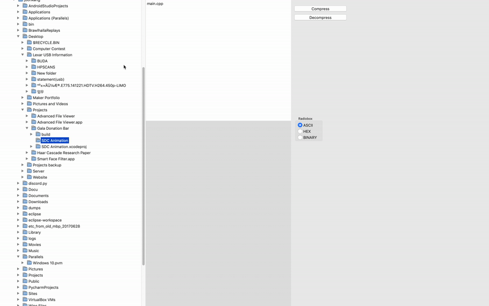
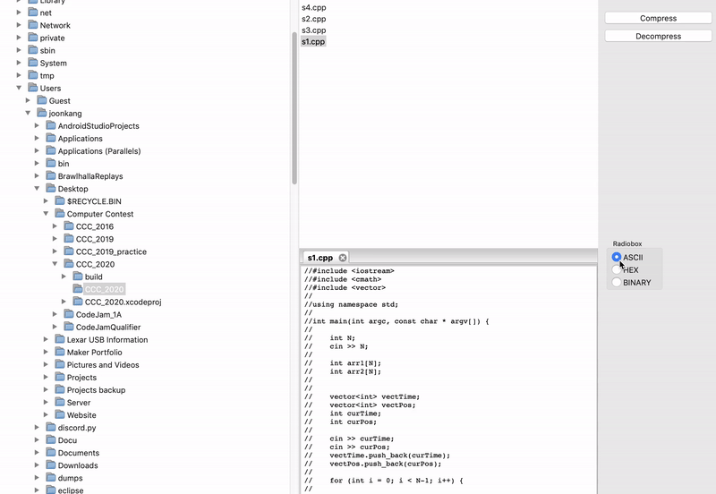

# Advanced File Viewer

This program is an advanced file viewer that takes features from a regular file viewer but adds more advanced features such as viewing files in hexadecimal and compressing files. The program was inspired by the lack of a convenient multiple purpose tool on the MacOS platform. 

<p align="left">
  
</p>

Features
--------

- **Compressing** and **decompressing** files.
- Viewing files in **ascii**, **hexadecimal**, and **binary**.
- Opening and viewing **multiple files** at once.
- Remembers last opened folder path.


Installation
------------

Install wxWidget library: https://github.com/wxWidgets/wxWidgets/archive/v3.1.0.zip

<br>

Compile wxWidget

```Shell
cd wxWidgets-3.1.0

mkdir build-cocoa-debug

cd build-cocoa-debug

../configure --enable-debug

make
```

In Xcode under `Project Settings -> Build Settings -> Header Search Paths`

	wxWidgets-3.1.0/build-cocoa-debug/lib
	wxWidgets-3.1.0/include
	
In Xcode under `Project Settings -> Build Settings -> Library Search Paths`

	wxWidgets-3.1.0/build-cocoa-debug/lib
	
In Xcode under `Project Settings -> General`, link all libraries ending with .dylib in `wxWidgets-3.1.0/build-cocoa-debug/lib`

Usage
-----

- Navigate file directory using the left window.

<p align="left">
  
</p>

- Select files in the middle window to view. 

<p align="left">
  
</p>

- **Compress** and **decompress** files by selecting a file and pressing their respective buttons (*Note that only .lz77 files can be decompressed*).

<p align="left">
  
</p>

- View file content in **ascii**, **hexadecimal**, and **binary** using the radio box.

<p align="left">
  
</p>

Staff
-----

Programmer : Joon Kang


Mentor : Samil Chai


Work Period
-----------

Start Date: 2017-06-02


End Date: 2017-09-07


Privacy
-------

*Portions of source code have been removed for privacy purposes.*
